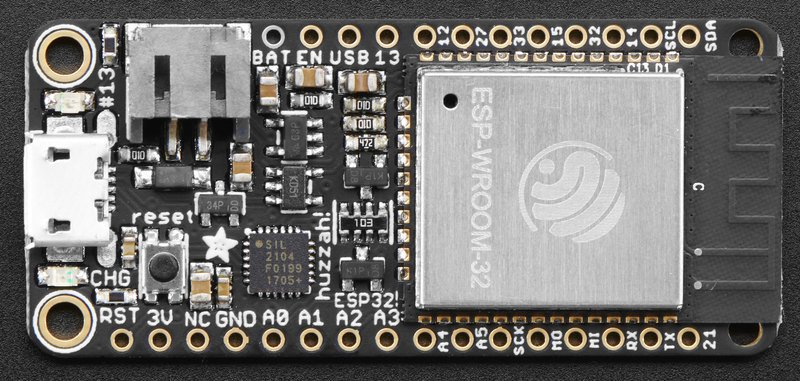

# Repo to hold board information
### 

## Contents
- [Notes](#notes)
- [Installation Instructions](#installation-instructions)
- [Decoding Exceptions](#decoding-exceptions)
- [Issue/Bug report template](#issuebug-report-template)
- [Adafruit HUZZAH32 Feather](#Adafruit-HUZZAH32)
- [Arduino Nano](#ARDUINO-NANO)
- [Esp32-devkitC](#esp32-devkitC-v4)
- [WEMOS LOLIN32 with OLED Board](#WEMOS-LOLIN32)
- [WeMos d1 Mini Pro](#d1_Mini_Pro)
- [Heltec WiFi LORA 32 V1](#Heltec-WiFi-LORA-32-V1)
- [Heltec WiFi LORA 32 V2](#Heltec-WiFi-LORA-32-V2)
- [Esp32 with battery holder and OLED](#TTGOBatteryOLED)
- [Adafruit ADS1115](#Adafruit-ADS1115)
- [BME280/BMP280 Pressure/Temperature/Humidity sensor](#BME280/BMP280)
- [MPRLS Pressure sensor](#MPRLS)
- [LSM303DLHC e-Compass 3 Axis Accelerometer + 3 Axis Magnetometer Module Sensor](#LSM303DLHC) 

## Notes
- You may have to push the button to upload to the board
- ADS1115 does not seem to work with HW enabled on the OLED on the WiFi LORA
## Installation Instructions
- Use VS Code and PlatformIO

#### Decoding exceptions
- I have no idea how to do this or what they are talking about.

#### Issue/Bug report template
- Finally, if you're sure no one else had the issue, it's probably you.

## Adafruit HUZZAH32
Board name Adafruit HUZZAH32 – ESP32 Feather Board. For PlatformIO use "featheresp32" for the board type. 
Board has a built in LED on pin 13 defined as "LED_BUILTIN". To upload code there is no need to hold down a button. 

## ARDUINO NANO
Board name ARDUINO NANO atmega328. For PlatformIO use "nanoatmega328" for the board type. 

## esp32-devkitC-v4
Board name esp32-devkitC v4. For PlatformIO use "esp32dev" for the board type. 
Purchased several of these. They have a connection for an external antenna. 

## WEMOS LOLIN32
Board name WEMOS LOLIN32. For PlatformIO use "lolin32" for the board type. 
<ul>
    <li>OLED Connections:</li>
        <li>CLOCK 4</li>
        <li>DATA 5</li>
        <li>RESET 16</li>
</ul>

## - #WEMOS LOLIN32V100
Board name WeMos LOLIN32 V1.0.0. For PlatformIO use "" for the board type. 

## - #d1_Mini_Pro
Board name WeMos d1 Mini Pro. For PlatformIO use "" for the board type. 

## Heltec WiFi LORA 32 V1
Heltec WiFi LORA 32 V1 – For PlatformIO use "heltec_wifi_lora_32" for the board type. 
ESP32 with OLED and LORA Board 
To program you need to hold button labeled PRG near coil antenna. 
<ul>
    <li>I2C Connections:</li>
        <li>SCL 22</li>
        <li>SDA 21</li>
    <li>OLED Connections:</li>
        <li>CLOCK 15</li>
        <li>DATA 4</li>
        <li>RESET 16</li>
</ul>

## Heltec WiFi LORA 32 V2
Heltec WiFi LORA 32 V2 – For PlatformIO use "heltec_wifi_lora_32_V2" for the board type. 
ESP32 with OLED and LORA Board 
To program you need to hold button labeled PRG near coil antenna. 
I have unresolved issues using a second I2C device with the OLED 
<ul>
    <li>I2C Connections:</li>
        <li>SCL 22</li>
        <li>SDA 21</li>
    <li>OLED Connections:</li>
        <li>CLOCK 15</li>
        <li>DATA 4</li>
        <li>RESET 16</li>
</ul>

## TTGOBatteryOLED
TTGO ESP32 with builtin battery holder and OLED – For PlatformIO use "TTGOBatteryOLED" for the board type. 
<ul>
    <li>OLED Connections:</li>
        <li>CLOCK 4</li>
        <li>DATA 5</li>
        <li>RESET NULL</li>
</ul> 

 
 

## Adafruit ADS1115
I2C address is 0x48 
Supply Range: 2.0V to 5.5V DC 
The ADS1115 provides 16-bit ADC precision at 860 samples/second over I2C. The chip can be configured as 4 single-ended input channels, or two differential channels. As a nice bonus, it even includes a programmable gain amplifier, up to x16, to help boost up smaller single/differential signals to the full range.  
 
Go to [Adafruit](https://www.adafruit.com/product/1085) for more information. 

## BME280/BMP280
I2C address is 0x76 or 0x77 if you cut the trace between the left two pads and add a jumper to the right two pads. 
Supply Range: 1.8V to 5V DC 
The BME280 has Pressure, Temperature, and Humidity. The BMP only has Pressure and Temperature. 
 
Go to [Adafruit](https://learn.adafruit.com/adafruit-bme280-humidity-barometric-pressure-temperature-sensor-breakout) for more information. 

## MPRLS
I2C address is 0x18 and cannot be changed. 
Supply Range: 2.0V to 5.5V DC 
The MPRLS has Pressure sensing of 0-25 PSI with a push on a tube connection. 
 
Go to [Adafruit](https://www.adafruit.com/products/3965) or [Sparkfun](https://www.sparkfun.com/products/16476) for more information. 

## LSM303DLHC
I2C address is 0x19 AND 0x1E and cannot be changed. 
Supply Range: 2.0V to 5.5V DC 
The LSM303DLHC is a Triple-axis Accelerometer+Magnetometer (Compass) Board. 
  
This board is a knock off and is completely untested. 
Go to [Adafruit](https://www.adafruit.com/product/1120) for more information. New information is [LSM303 Accelerometer + Compass Breakout.](https://learn.adafruit.com/lsm303-accelerometer-slash-compass-breakout/coding) 

## Hint
Keep at it.