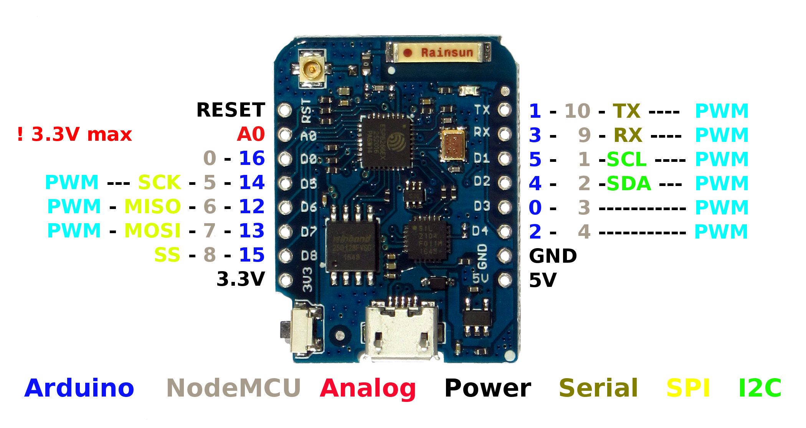
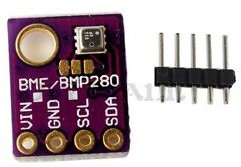

# Repo to hold board information
## 
## 

### 

## Contents
- [Notes](#notes)
- [Installation Instructions](#installation-instructions)
- [Decoding Exceptions](#decoding-exceptions)
- [Issue/Bug report template](#issuebug-report-template)
- [WEMOS LOLIN32 with OLED Board](#WEMOS-LOLIN32)
- [WeMos d1 Mini Pro](#d1_Mini_Pro)
- [Heltec WiFi LORA 32 V1](#Heltec-WiFi-LORA-32-V1)
- [Heltec WiFi LORA 32 V2](#Heltec-WiFi-LORA-32-V2)
- [Adafruit ADS1115](#Adafruit-ADS1115)
- [BME280](#BME280)

## Notes

You may have to push the button to upload to the board
ADS1115 does not seem to work with HW enabled on the OLED on the WiFi LORA
## Installation Instructions
- Use VS Code and PlatformIO

#### Decoding exceptions

I have no idea how to do this or what they are talking about.

#### Issue/Bug report template

Finally, if you're sure no one else had the issue, it's probably you.

## WEMOS LOLIN32
Board name WEMOS LOLIN32. 
<ul>
    <li>OLED Connections:</li>
        <li>CLOCK 4</li>
        <li>DATA 5</li>
        <li>RESET 16</li>
</ul>

## - #WEMOS LOLIN32V100
Board name WeMos LOLIN32 V1.0.0 

## - #d1_Mini_Pro
Board name WeMos d1 Mini Pro 

## Heltec WiFi LORA 32 V1
Heltec WiFi LORA 32 V1 – ESP32 with OLED and LORA Board 
To program you need to hold button labeled PRG near coil antenna. 
<ul>
    <li>I2C Connections:</li>
        <li>SCL 22</li>
        <li>SDA 21</li>
    <li>OLED Connections:</li>
        <li>CLOCK 15</li>
        <li>DATA 4</li>
        <li>RESET 16</li>
</ul>

## Heltec WiFi LORA 32 V2
Heltec WiFi LORA 32 V2 – ESP32 with OLED and LORA Board 
To program you need to hold button labeled PRG near coil antenna. 
I have unresolved issues using a second I2C device with the OLED 
<ul>
    <li>I2C Connections:</li>
        <li>SCL 22</li>
        <li>SDA 21</li>
    <li>OLED Connections:</li>
        <li>CLOCK 15</li>
        <li>DATA 4</li>
        <li>RESET 16</li>
</ul>

## Adafruit ADS1115
I2C address is 0x48

## BME280
I2C address is 0x76 or 0x77 if you cut the trace between the left two pads and add a jumper to the right two pads.

## Hint
Keep at it.